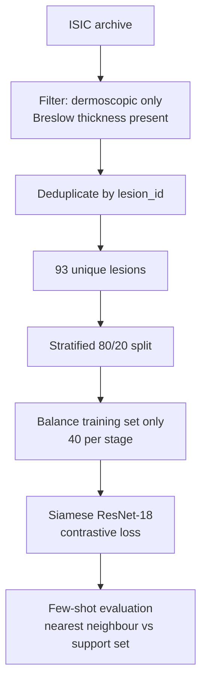

<div align="center">

# Siamese Melanoma Staging

**Few-shot Breslow-thickness classification from dermoscopic images**

A metric-learning approach to melanoma stage estimation under extreme data scarcity — and an honest account of what 93 lesions can and cannot support.

[](https://python.org)
[](https://pytorch.org)
[](#dataset)
[](#read-this-before-citing)
[](LICENSE)

</div>


## Read this before citing

This is a **feasibility study on a severely underpowered cohort**, not a validated staging model. The distinction matters, so it is stated plainly rather than buried in a limitations paragraph:

| | |
|:---|:---|
| Unique lesions after filtering | **93** |
| Validation set | **19 images** |
| Stage III validation samples | **1** |
| Reported accuracy | 68.42% (13/19) |
| **Majority-class baseline** | **73.68% (14/19)** |
| 95% confidence interval (Wilson) | **[46%, 85%]** |

**A constant classifier that always predicts Stage I outperforms this model on accuracy.** The confidence interval spans from near-chance to strong. No claim about clinical or comparative performance can be supported by this evidence.

The model does beat the trivial baseline on **macro-F1** (0.590 vs 0.283), which indicates it is discriminating between classes rather than collapsing onto the majority — but on a cohort this size that observation is suggestive at best.

---

## Results

Full classification report, reproduced verbatim from the notebook:

```
              precision    recall  f1-score   support

     Stage I     0.8333    0.7143    0.7692        14
    Stage II     0.5000    0.5000    0.5000         4
   Stage III     0.3333    1.0000    0.5000         1

    accuracy                         0.6842        19
   macro avg     0.5556    0.7381    0.5897        19
weighted avg     0.7368    0.6842    0.6984        19
```

**How to read the Stage III row:** those three numbers are computed from one image. Recall of 1.0000 means that single image was classified correctly; had it not been, the same row would read 0.0000. It is not a measurement.

### Two reported accuracies

The notebook produces **63.16%** during training and **68.42%** in the standalone evaluation cell, from identical weights. The cause is a normalisation mismatch between the two model definitions:

```python
# training — embeddings projected to the unit hypersphere
x = self.fc(x)
x = F.normalize(x, p=2, dim=1)
return x

# evaluation — normalisation absent
x = self.fc(x)
return x
```

Contrastive loss optimises Euclidean distance on normalised embeddings. Evaluating with `torch.cdist` on unnormalised embeddings measures distance in a different space than the one the model was trained in. **Neither figure should be quoted**; the higher one is the product of the bug.

---

## Method

The approach is appropriate for the problem, and is the part of this work worth reusing.



**Why metric learning.** With fewer than 100 samples, training a conventional 3-way classifier is hopeless — the head alone has more parameters than the dataset has examples. A Siamese network instead learns an embedding where same-stage lesions cluster, then classifies by nearest neighbour against a support set. This is the standard response to data scarcity and it is the right instinct here.

**Architecture.** ResNet-18 backbone (ImageNet-pretrained, final layer removed) → `Linear(512, 256)` → ReLU → `Linear(256, 128)` → L2 normalisation. Shared weights across both branches.

**Loss.** Contrastive loss with margin 1.0 — minimising distance for same-stage pairs, pushing different-stage pairs apart up to the margin.

**Training.** Adam at 1e-4, `CosineAnnealingWarmRestarts` (T₀=10, T_mult=2), batch size 32, 50 epochs. Augmentation: horizontal and vertical flips, ±20° rotation, mild colour jitter.

**Evaluation.** Support-set embeddings extracted from training data, query embeddings from validation, classification by nearest neighbour under `cdist`.

### Stage definitions

Stages are assigned from Breslow thickness:

| Label | Breslow thickness |
|:---|:---|
| Stage I | < 0.76 mm |
| Stage II | 0.76 – 1.5 mm |
| Stage III | > 1.5 mm |

> [!IMPORTANT]
> This is **not AJCC staging.** Clinical staging incorporates ulceration, mitotic rate, and nodal involvement, none of which are available here. The task performed is *Breslow thickness category estimation from dermoscopic appearance*. That is a legitimate research question — thickness correlates with surface morphology — but it is a narrower claim than "melanoma staging," and the two should not be conflated.

---

## What was done correctly

Recorded because these are the details most commonly botched in dermoscopy work, and they were handled properly:

- **Deduplication by `lesion_id` before splitting.** The same lesion never appears in both partitions. This is the most frequent source of inflated results in published skin-lesion models.
- **Split before balancing.** Class balancing is applied only to the training partition, so no synthetic or duplicated samples leak into validation.
- **Dermoscopic-only filtering.** Mixing clinical photographs with dermoscopy introduces a domain shift that models exploit as a shortcut.

---

## Known issues

**1. Cohort size.** 93 lesions, 19 held out. The filter requiring both dermoscopic imaging *and* recorded Breslow thickness is what reduces the archive to this size.

**2. Single Stage III validation sample.** No per-class metric for Stage III is meaningful.

**3. Model selection on the reported split.** The training loop saves the best checkpoint by validation accuracy across 50 epochs, and the same split is then reported:

```python
acc = evaluate_accuracy(model, Config.DEVICE)
if acc >= best_acc:
    best_acc = acc
    torch.save(model.state_dict(), "siamese_melanoma_model.pth")
```

Taking the maximum over 50 evaluations on 19 samples is optimistically biased even for a model that has learned nothing. A three-way train/validation/test split is required.

**4. Normalisation mismatch** between the training and evaluation model definitions, as described above.

**5. Memorisation.** Training loss falls from 0.2854 to 0.0037 while accuracy remains flat. With `TARGET_COUNT = 40` and `replace=True`, ~120 training samples are drawn from ~74 unique images, so positive pairs frequently consist of the *same photograph* under two augmentations. The network learns augmentation invariance rather than stage discrimination.

**6. Patient-level leakage not controlled.** Deduplication is by lesion, not patient. Multiple lesions from one patient may span the split.

---

## Toward a valid study

The roadmap for a corrected version, in order of expected impact:

1. **Expand the cohort.** Pool ISIC releases with Breslow metadata. Low hundreds per class is the minimum for three-way classification.
2. **Reduce to binary.** Thin (< 0.8 mm) versus thick (≥ 0.8 mm) is the clinically decisive threshold and roughly triples per-class counts.
3. **Three-way split.** Select on validation, report once on test.
4. **Fix the normalisation mismatch.**
5. **Report confidence intervals and the majority-class baseline** alongside every accuracy figure.
6. **Split by `patient_id`.**
7. **Sample positive pairs without replacement** so a photograph is never paired with itself.

---

## Evaluation limitations affecting reported metrics

Tracking issue for evaluation problems identified after publication.
Recorded here for transparency; a corrected study is in preparation.

## Issues

1. **Cohort size.** 93 unique lesions after filtering for dermoscopic
   imaging with recorded Breslow thickness; 19 images held out for
   validation.

2. **Single Stage III validation sample.** Per-class metrics for
   Stage III (P=0.333, R=1.000, F1=0.500) are computed from one image
   and are not meaningful.

3. **Accuracy does not exceed the majority-class baseline.** Reported
   68.42% (13/19) against a constant Stage I classifier at 73.68%
   (14/19). Wilson 95% CI: [46%, 85%]. The model does exceed the
   trivial baseline on macro-F1 (0.590 vs 0.283).

4. **Model selection performed on the reported split.** Best checkpoint
   is chosen by validation accuracy across 50 epochs and the same split
   is then reported. A three-way train/validation/test split is required.

5. **Embedding normalisation mismatch.** The training model applies
   `F.normalize(x, p=2, dim=1)`; the evaluation model does not. This
   produces two different accuracies (63.16% and 68.42%) from identical
   weights. Neither should be quoted.

6. **Memorisation.** Training loss falls 0.2854 -> 0.0037 with flat
   accuracy. With `TARGET_COUNT=40` and `replace=True`, positive pairs
   frequently consist of the same photograph under two augmentations.

7. **Patient-level leakage not controlled.** Deduplication is by
   `lesion_id`, not `patient_id`.

## Planned corrections

- Expand cohort using pooled ISIC releases with Breslow metadata
- Reduce to binary classification (thin <0.8mm / thick >=0.8mm)
- Three-way split; report once on a held-out test set
- Fix the normalisation mismatch
- Report confidence intervals and the majority-class baseline alongside
  all accuracy figures
- Split by `patient_id`
- Sample positive pairs without replacement
```

Requires the ISIC dermoscopic subset with `mel_thick_mm` metadata. The notebook's Kaggle credential cells have been removed — configure `~/.kaggle/kaggle.json` yourself before running.

```bash
jupyter notebook melanoma-siamese.ipynb
```


## License

MIT — see [LICENSE](LICENSE). **Research code. Not a medical device, and not for clinical use.**

---


